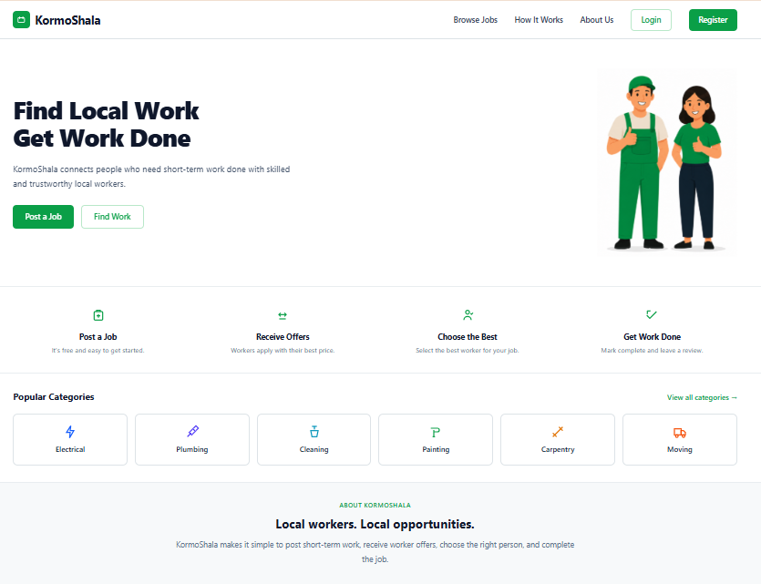
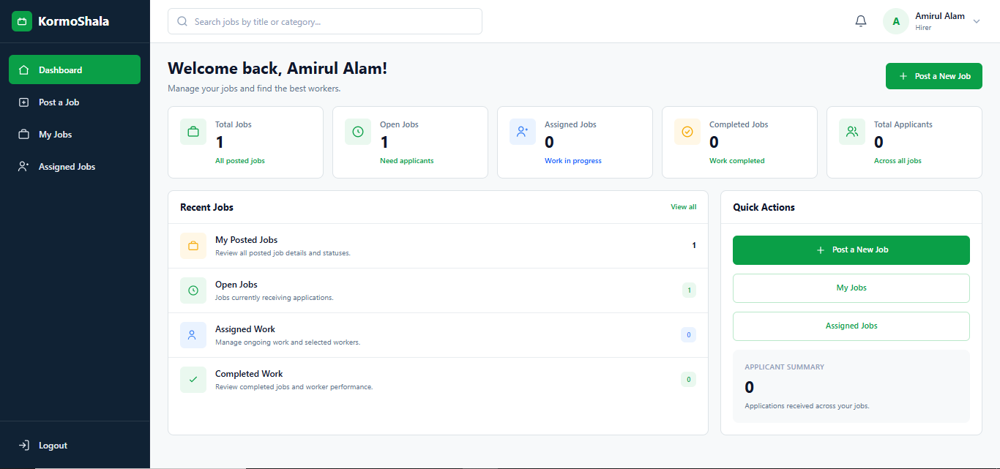
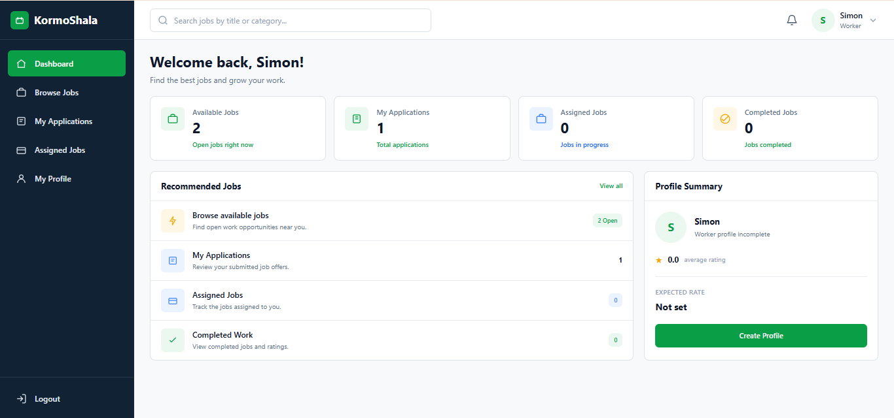
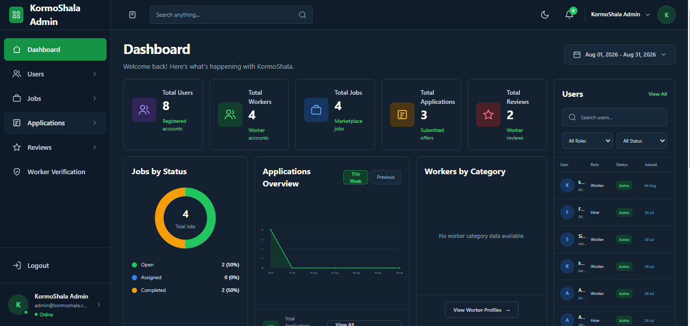
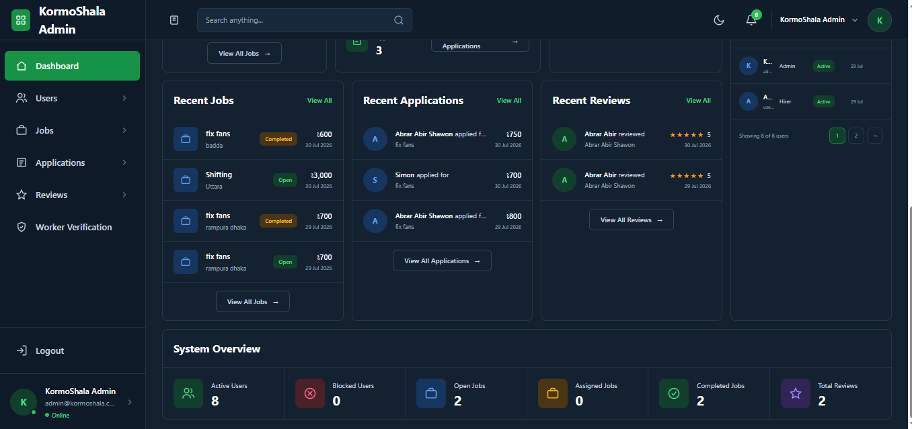

# KormoShala — Full-Stack Web Application

KormoShala is a **Laravel-based full-stack web application** that connects local workers and hirers through a structured role-based workflow system. It was developed to simplify local service hiring by enabling job posting, worker applications, assignment management, and service completion through secure, role-specific workflows.

> **Live Demo:** https://kormoshala-production.up.railway.app/  
> **Repository:** https://github.com/amirul-zq/KormoShala

---

# 📌 Project Overview

KormoShala demonstrates practical software engineering concepts through a real-world web application.

### Worker
- Browse available jobs
- Apply for jobs
- Manage assigned work
- Complete tasks
- Submit ratings and reviews

### Hirer
- Create job posts
- Review applications
- Select workers
- Manage assignments
- Rate completed work

### Administrator
- Manage platform users
- Monitor system activities

---

# ✨ Key Features

- Role-based Authentication & Authorization
- Laravel MVC Architecture
- Job Posting & Application Workflow
- Worker Selection & Assignment
- Rating & Review System
- Relational Database Design
- Server-side Validation
- CSRF Protection
- Eloquent ORM Relationships

---

# 🛠️ Technology Stack

## Backend
- PHP
- Laravel
- Eloquent ORM

## Frontend
- Blade
- Tailwind CSS
- HTML
- JavaScript

## Database
- MySQL

## Development Tools
- Git
- GitHub
- Composer
- Vite
- Node.js
- NPM

---

# 📸 Screenshots

## Home Page


## Hirer Dashboard


## Worker Dashboard


## Admin Dashboard




---

# 🏗️ Software Engineering Concepts

- Object-Oriented Programming (OOP)
- MVC Architecture
- CRUD Operations
- Authentication & Authorization
- Role-Based Access Control
- Relational Database Design
- Database Normalization
- Business Logic Implementation
- Secure Web Application Development

---

# 📂 Suggested Repository Structure

```text
KormoShala/
├── README.md
├── screenshots/
│   ├── home.png
│   ├── hirer.png
│   ├── worker.png
│   ├── admin1.png
│   └── admin2.png
├── app/
├── database/
├── public/
├── resources/
└── routes/
```

---

# ⚙️ Local Setup

```bash
git clone https://github.com/amirul-zq/KormoShala.git
cd KormoShala
composer install
npm install
cp .env.example .env
php artisan key:generate
# Configure database credentials in .env
php artisan migrate
npm run build
php artisan serve
```

---

## 6. Open the Application

Open your browser and visit:

```
http://127.0.0.1:8000
```

The project should now be running successfully.

---

# Default Login Credentials

Use the credentials available in the imported database.

### Admin Login :

Email : admin@kormoshala.com
Password : Admin123!

---

# Troubleshooting

## PHP Not Found

Verify PHP installation.

```bash
php -v
```

---

## Composer Not Found

Verify Composer installation.

```bash
composer -V
```

---

## Node.js Not Found

Verify installation.

```bash
node -v

npm -v
```

---

## Database Connection Error

Ensure that:

- MySQL Server is running.
- The `kormoshala` database exists.
- The database has been imported successfully.
- The `.env` database credentials are correct.

---

## Frontend Assets Not Loading

Run:

```bash
npm run dev
```

Keep the Vite server running while using the application.

---

## Port 8000 Already in Use

Run Laravel on another port.

```bash
php artisan serve --port=8001
```

Then open:

```
http://127.0.0.1:8001
```

---

# Daily Startup

Whenever you want to run the project:

Open two terminals inside the project folder.

**Terminal 1**

```bash
npm run dev
```

**Terminal 2**

```bash
php artisan serve
```

Open your browser and visit:

```
http://127.0.0.1:8000
```

---

# Project Structure

```
KormoShala/
│
├── app/
├── bootstrap/
├── config/
├── database/
├── public/
├── resources/
├── routes/
├── storage/
├── tests/
├── vendor/
├── package.json
├── composer.json
├── README.md
└── .env
```

---

# License

This project was developed for academic purposes as part of a university software development project.